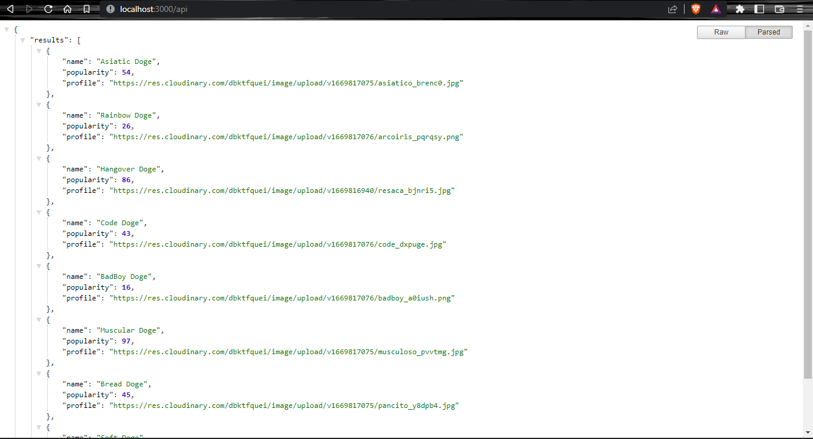
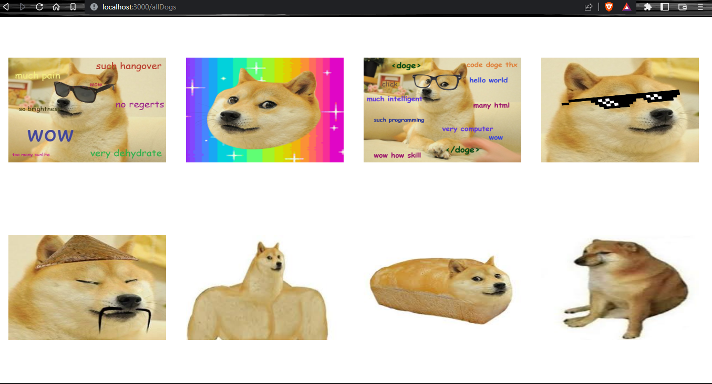
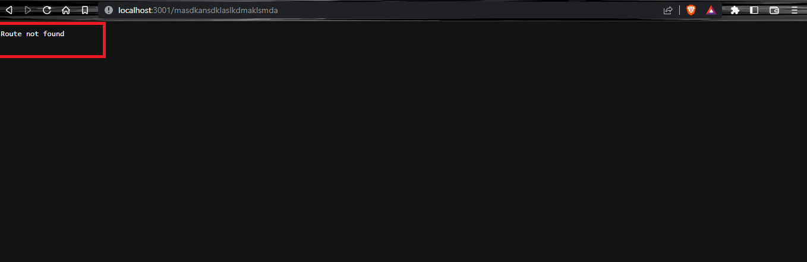

# HW 02: WEB SERVER | Ejercicios

## **🕒 Duración estimada**

x minutos

---

<br />

## **📌 INTRO**

En esta homework crearás un servidor básico con distintas rutas que cumplirán funcionalidades específicas.

---

<br />

## **📖 CONSIGNA**

Lee atentamente este **README** y realiza cada uno de los ejercicios.

---

<br />

## **✅ Pasos básicos para realizar la homework**

🔹 Para iniciar, debes pararte sobre la carpeta `01 - Excercises`.

Dentro de ella escribe los comandos:

```bash
npm install
npm test
```

Si deseas correr por test, puedes utilizar:

```bash
npm run test:01
```

Con este comando podrás levantar el servidor y comprobar que todo funciona correctamente:

```bash
npm start
```

---

<br />

## **ESTRUCTURA**

🔹 Dentro de la carpeta `01 - Exercises`, vas a encontrar la siguiente estructura:

-  Una carpeta llamada `utils`.
-  Una carpeta llamada `tests`.
-  Un archivo **server.js**.
-  Un archivo **.gitignore**.
-  Un archivo **package.json**.
-  Y el archivo **README.md** que ahora mismo estás leyendo. 😙

---

<br />

## **👩‍💻 EJERCICIO 1**

### **SERVER RAISE**

📍 Dirígete al archivo `server.js`. Allí encontrarás las variables **fs** y **http** importadas.

📍 Lo que hay que hacer:

1. Al comienzo del archivo modifica la constante llamada `PORT` ya que debe ser igual al número `3001`.

2. Para levantar un servidor tendrás que utilizar el objeto **http** y acceder a su propiedad "**_createServer_**". Esta propidad recibe un callback como argumento.

3. El callback/función que debes pasarle recibe dos parámetros (**req** (_request_) y **res** (_response_)). Dentro de esta función debes escribir:

```javascript
console.log(`Server raised in port ${PORT}`);
```

4. A continuación de la propiedad "**_createServer_**" deberás concatenar la propiedad "**_listen_**". Esta recibe dos parámetros. El primero es la constante **PORT** que creaste al comienzo. El segundo es el string: `localhost` (para indicarle que el puerto es de nuestra PC).

> **[NOTA:]** este primer ejercicio lleva un test que **siempre correrá exitosamente**.

---

<br />

## **👩‍💻 EJERCICIO 2**

### **ENDPOINTS - API (json)**

📍 Dirígete al archivo `server.js`. Dentro de la función callback que le pasamos a "**_createServer_**" comenzaremos a crear nuestras primeras rutas. En este ejercicio crearemos una ruta que responde información a partir de un JSON.

📍 Lo que hay que hacer:

1. Debajo del `console.log`, crea un condicional que verifique si `req.url` es igual a "_/api_".

2. En el caso de que esto sea verdadero llamaremos a la propiedad **readFile** del objeto **fs**. Esta propiedad recibe dos parámetros.

   -  Por un lado un string con la ruta del archivo que necesitamos. En este caso el archivo es `dogsData.json` dentro de la carpeta "utils".

   -  El segundo parámetro es un callback/función. Esta función recibe dos parámetros: `err` y `data`. El primero nos avisará si la librería _FileSystem_ tuvo un problema para leer el archivo. El segundo será la información del archivo si es que la librería logra leerlo correctamente. Es por esto que, dentro de esta función crearemos un condicional.

      -  Si lo que ocurrió fue un **error** el servidor debe devolver una respuesta con un status `404`, un Content-Type igual a `text/plain`, y finalmente un mensaje con el string "`json not found`".

      -  Si el archivo se leyó correctamente el servidor debe devolver una respuesta con status `200`, un Content-Type igual a `application/json`, y finalmente el parámetro **data**.

3. Fuera de la función **readFile** pero dentro del condicional padre escribe la palabra `return` sola. De esta manera no continuará ejecutándose nada por debajo.

---

<br />

## **⛔️ STOP**

### **PROBEMOS EL END-POINT**

Hasta ahora ya creamos nuestra primera ruta que nos responde con un JSON. Para probarlo:

1. Ejecuta el comando `npm start` en esta carpeta y levanta el servidor.

2. Dirígete a tu navegador e ingresá a la URL: `http://localhost:3001/api`.

3. ¡Listo! Construiste tu primera ruta 😁. Debería quedate algo como esto:



> **[NOTA]:** si quieres ver la información ordenada como en la imagen puedes instala la extensión de chrome [**JSON Formatter**](https://chrome.google.com/webstore/detail/json-formatter/bcjindcccaagfpapjjmafapmmgkkhgoa?hl=es).

---

<br />

## **👩‍💻 EJERCICIO 3**

### **ENDPOINTS - ALL DOGS (html)**

📍 Seguimos en el archivo `server.js`. Dentro de la función callback que le pasamos a "**_createServer_**" crearemos una nueva ruta. Esta nos permitirá ver un archivo html. Puedes codearla debajo de la anterior.

📍 Lo que hay que hacer:

1. Declarar un condicional que verifique si `req.url` es igual "_/allDogs_".

2. En el caso de que esto sea verdadero, volveremos a utilizar la propiedad _readFile_ del objeto **fs**.

3. Este callback recibirá tres parámetros.

   -  **String:** este string debe ser la ruta que dirija al archivo `utils/allDogs.html`.

   -  **String:** este string debe decir `UTF8`.

   -  **Callback:** esta función recibe dos parámetros: `err` y `data`. Dentro de la función crearemos un condicional:

      -  Si lo que ocurrió fue un **error** el servidor debe devolver una respuesta con un status `404`, un Content-Type igual a `text/plain`, y finalmente un mensaje con el string "`html not found`".

      -  Si el archivo se leyó correctamente el servidor debe devolver una respuesta con status `200`, un Content-Type igual a `text/html`, y finalmente el parámetro **data**.

4. Por último, fuera de la función **readFile** pero dentro del condicional padre escribe la palabra `return` sola.

---

<br />

## **⛔️ STOP**

### **PROBEMOS EL ENDPOINT**

Ahora que ya tenemos una nueva ruta, ¡vamos a utilizarla!

1. Dirígete a tu navegador e ingresá a la url: `http://localhost:3001/allDogs`.

2. ¡Listo! Ya puedes ver a todos nuestros amigos doges. Debería quedate algo como esto:



---

<br />

## **👩‍💻 EJERCICIO 4**

### **ENDPOINTS - ERROR**

📍 Seguimos en el archivo `server.js`. Dentro de la función callback que le pasamos a "**_createServer_**" crearemos nuestra última ruta. Esta nos permitirá avisar que hubo un error en el caso de que no se ingrese a una ruta adecuada.

📍 Lo que hay que hacer:

-  Luego de todos los condicionales (es decir, al final del **callback**), tendrás que simplemente devolver una respuesta con un status `404`, un Content-Type igual a `text/plain`, y finalmente un mensaje con el string "`Route not found`".

---

<br />

## **⛔️ STOP**

### **PROBEMOS EL ENDPOINT**

Hasta ahora ya contruiste un endpoint que muestra a nuestro amiguito en el navegador, ¿Aún no lo viste?

1. Ejecuta el comando `npm start` en esta carpeta y levanta el servidor.

2. Dirígete a tu navegador e ingresá a la url: `http://localhost:3001`.

3. Para ver si el mensaje de error funciona correctamente, escribe en la URL cualquier texto que no coincida con el de las rutas anteriores.



---

<br />

## **🔎 Recursos adicionales**

-  Documentación [**¿QUÉ ES UN SERVIDOR WEB?**](https://developer.mozilla.org/es/docs/Learn/Common_questions/What_is_a_web_server)
-  Documentación [**CONTENT-TYPE**](https://developer.mozilla.org/es/docs/Web/HTTP/Basics_of_HTTP/MIME_types/Common_types)
-  Documentación [**FILE SYSTEM**](https://nodejs.org/api/fs.html)

---

<br />

¡Listo! Aprendiste a crear un servidor y rutas con información de tipo **HTML**, **IMÁGENES** y **JSON** 🥳.
