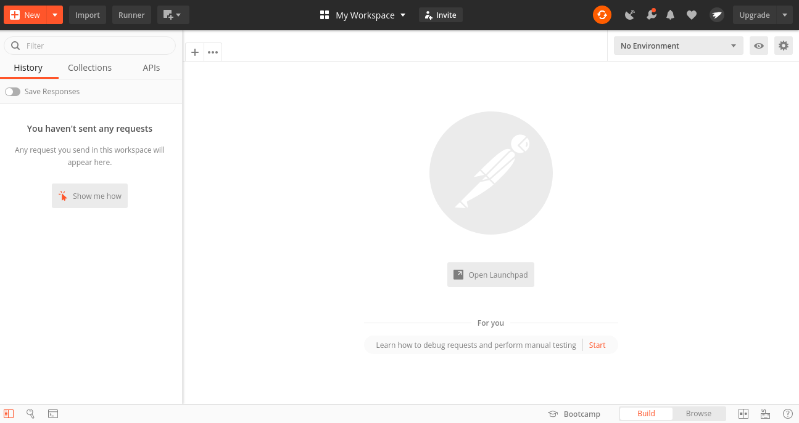
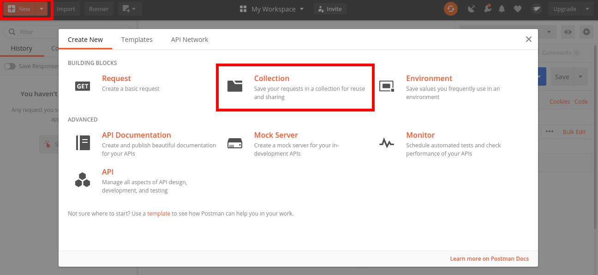
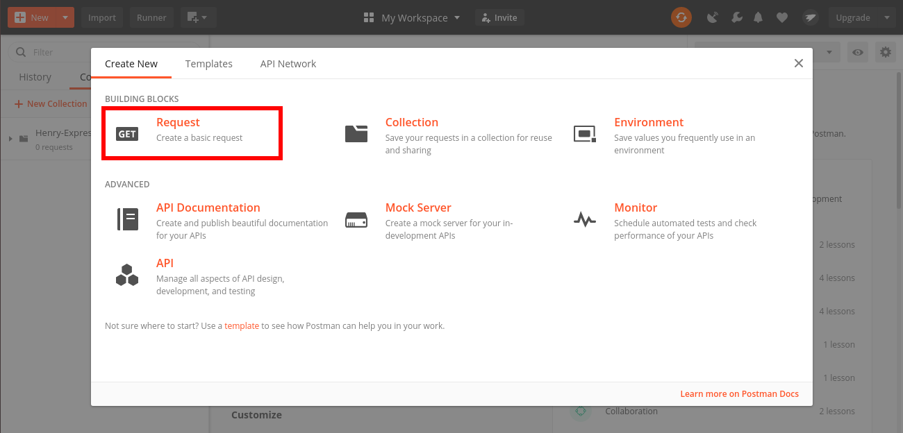
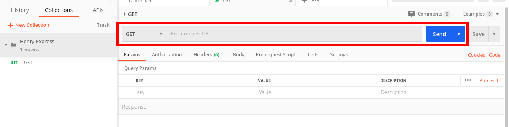
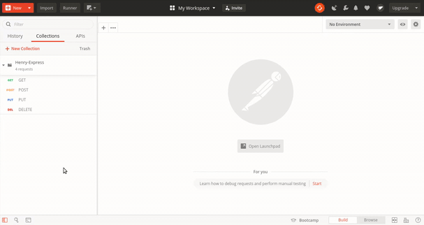

# HW 05: Express | Ejercicios

## **🕒 Duración estimada**

x minutos

---

<br />

## **📌 INTRO**

En esta homework vas a desarrollar una API que permitirá gestionar `publicaciones`, utilizando el concepto CRUD similar a un gestor de publicaciones de cualquier red social conocida, vas a realizar las siguientes acciones:

- Crear nuevas publicaciones
- Consultar las publicaciones existentes
- Actualizar las publicaciones existentes
- Eliminar las publicaciones existentes

---

<br />

## **📍 CONSIGNA**

En esta homework debes generar una API para gestionar **publicaciones**, como no trabajarás con una base de datos, simularemos una en el que los datos serán almacenados en memoria utilizando un array de Javascript denominado `publications`.

Cada `Publicacion` debe ser un objeto con la siguiente estructura:

```js
{
  author: "Autor de la publicación"
  title: "Titulo del publicación",
  contents: "Contenido de la publicación"
}
```

Tanto `author` como `title` y `contents` van a ser del tipo String.

Desarrollar las rutas `POST`, `GET`, `PUT` y `DELETE` dentro del archivo `server.js` que se encuentra dentro de la carpeta `src`.

---

<br />

## **📖 Pasos básicos para realizar la homework**

🔹 Para poder ejecutar los `test` de esta homework, es necesario que abramos la terminal ubicados dentro de la carpeta `01 - Exercises`.

- Cuando te encuentres en esta carpeta, debes ejecutar el comando

```bash
npm install
```

¡Listo! Ya puedes correr los test:

```bash
npm test
```

Si deseas correr por test, puedes utilizar:

```bash
npm run test:01
```

🔹 Para correr el servidor y que automáticamente se restaure si realizamos algún cambio debes ejecutar `npm run nodemon`.

```bash
npm run nodemon
```

🔹 Una vez esté todo configurado puedes hacer los requests a `http://localhost:3001` que es la URL donde correrá nuestro servidor.

---

<br />

## **ESTRUCTURA**

🔹 Dentro de la carpeta `01 - Exercises`, vas a encontrar la siguiente estructura:

- Una carpeta llamada `img`.
- Una carpeta llamada **src**.
- Una carpeta llamada **tests**.
- Un archivo `package.json`
- Y el archivo **README.md** que ahora mismo estás leyendo. 😙

🔹 Dentro de la carpeta `src`, vas a encontrar la siguiente estructura:

- Un archivo llamado `app.js`
- Un archivo llamado **server.js**

---

<br />

## **👩‍💻 Repaso de creación de rutas**

Básicamente, la creación de rutas sirve para determinar cómo una aplicación responde a la solicitud de un cliente en una determinada vía de acceso (llamada URI) con un método de solicitud HTTP específico. En otras palabras, lo que vamos a hacer es invocar uno de estos métodos HTTP (especialmente POST, GET, PUT, HEAD y DELETE), utilizando la variable app, para indicarle la acción que queremos realizar y disponer la ruta que queremos para una determinada URI.

Es por esto que la definición de creación de rutas es la siguiente:

```javascript
server.METHOD(PATH, HANDLER);
```

Donde:

- server es una instancia de express
- METHOD es un método de solicitud HTTP
- PATH es la vía de acceso al servidor
- HANDLER es la función que se ejecuta cuando se hace el direccionamiento a la ruta, siempre recibe como parámetro dos variables, req por request y res por response.

Veamos ahora un ejemplo más concreto. El método GET se utiliza para leer la representación de un resource, que puede estar en distintos formatos tales como una imagen, un JSON, un XML, etc. Por lo que utilizando nuestra instancia de express vamos a invocar a get indicando la ruta que queremos para `'/'` y mandar una response con un "Hola mundo!" como texto.

```javascript
server.get("/", function (req, res) {
  //Ruta para un GET a /
  res.send("Hola mundo!"); // response "Hola mundo!" en la pagina principal
});
```

Si en lugar de texto queremos que se envíe con el formato JSON podríamos hacer lo siguiente:

```javascript
server.get("/", function (req, res) {
  var obj = {
    saludo: "Hola mundo!",
  };
  res.json(obj);
});
```

Ahora supongamos que queremos setear el status de la response como 200 para indicar que la solicitud ha tenido éxito, para eso utilizaremos `res.status()`.

```javascript
server.get("/", function (req, res) {
  res.status(200).send("Hola mundo!");
});
```

Otro punto a tener en cuenta es que `req.body` se usa para tener los parámetros que son enviados por el cliente como parte de un request. Entonces, si por ejemplo quisiera acceder a la propiedad name podría utilizar `req.body.name`.

```javascript
server.post("/", function (req, res) {
  var obj = {
    saludo: "Hola" + req.body.name,
  };
  res.json(obj);
});
```

Para finalizar si queremos acceder a los parámetros de una consulta utilizaremos `req.query`. Por ejemplo, supongamos que se desea buscar 'toni' realizando un `GET /search?name=toni`, entonces lo que haremos será acceder al parámetro nombre de la query con `req.query.name`.

---

<br />

## **👩‍💻 EJERCICIO 1**

### **POST** ruta **/posts**

📍 Dirígete al archivo `server.js`, es el archivo donde desarrollaremos la homework.

📍 Crea la ruta `/posts` cuando se ejecute un request con el método **POST**.

📍 Lo que hay que hacer:

1. Asegurarse que dentro del body del request existan `author`, `title` y `contents`.

2. En el caso de que alguno de ellos no se encuentre, devolver un JSON con un objeto de la forma `{error: "No se recibieron los parámetros necesarios para crear la publicación"}`.

3. Si los tres campos fueron provistos, crear un nuevo objeto Publicación con los valores indicados para `author`, `title` y `contents` y asignándole un valor numérico único como propiedad `id`.
4. Agregar dicho objeto al array de **publications**. Devolver un JSON con el objeto recientemente creado.

> Hint: Verifica que el código de error sea el adecuado en todos los casos.

---

<br />

## **👩‍💻 EJERCICIO 2**

### A. **GET** ruta **/posts**

📍 Cuando se ejecute un request con el método **GET** en la ruta `/posts`.

📍 Lo que hay que hacer:

1. Si existe el parámetro `term` dentro de la URL (query-string parameter) devolver aquellas publicaciones que contengan el valor del parámetro `term` en su título o en su contenido (o en ambos).

2. Caso contrario, devolver todos las publicaciones que se encuentren almacenadas en el array `publications`.

### B. GET ruta **/posts?author=author?title=title**

📍 Cuando se ejecute un request con el método **GET** en la ruta `/posts?author=${author}?title=${title}`.

📍 Lo que hay que hacer:

1. Si existen publicaciones que coincidan con ambos queries, `author` y `title`, devolver aquellas publicaciones que correspondan con la información provista, es decir que coincidan `author` y `title`.

2. Caso contrario, devolver un JSON con un objeto de la forma `{error: "No existe ninguna publicación con dicho título y autor indicado"}`.

> Hint: Verifica que el código de error sea el adecuado en todos los casos.

---

<br />

## **👩‍💻 EJERCICIO 3**

### **GET** ruta **/posts/:author**

📍 Cuando se ejecute un request con el método **GET** en la ruta `/posts/:author`.

📍 Lo que hay que hacer:

1. Si existen publicaciones del autor indicado en el parámetro `author`, devolverlos.

2. Caso contrario, devolver un JSON con un objeto de la forma `{error: "No existe ninguna publicación del autor indicado"}`.

 > Hint: Verifica que el código de error sea el adecuado en todos los casos.

---

<br />

## **👩‍💻 EJERCICIO 4**

### **PUT** ruta **/posts/:id**

📍 Cuando se ejecute un request con el método **PUT** en la ruta `/posts/:id`.

📍 Lo que hay que hacer:

1. Asegurarse que reciba por params el `id`.

2. Asegurarse que dentro del body del request existan `title` y `contents`.

3. En el caso de que alguno de ellos no se encuentre, devolver un JSON con un objeto de la forma `{error: "No se recibieron los parámetros necesarios para modificar la publicación"}`.

4. En el caso de que el `id` no corresponda a una publicación válida existente, devolver un JSON con un objeto de la forma `{error: "No se recibió el id correcto necesario para modificar la publicación"}`.

5. Si se encuentran todos los parámetros y el `id` es válido, actualizar los datos del `title` y `contents` de la publicación que coincida con dicho `id`. Devolver un JSON con el objeto recientemente actualizado.

> Hint: Verifica que el código de error sea el adecuado en todos los casos.

---

<br />

## **👩‍💻 EJERCICIO 5**

### **DELETE** ruta **/posts/:id**

📍 Cuando se ejecute un request con el método **DELETE** en la ruta `/posts/:id`.

📍 Lo que hay que hacer:

1. Asegurarse que reciba por params un `id`. De no ser así, devolver un JSON con un objeto con un mensaje correspondiente manteniendo la forma de siempre: `{error: "No se recibió el id de la publicación a eliminar"}`.

2. En el caso de que el `id` corresponda a una publicación válida, eliminarlo del array de publications y devolver un JSON con el siguiente objeto: `{ success: true }`.

3. En el caso de que el `id` no corresponda a una publicación válida existente, devolver un JSON con un objeto de la forma `{error: "No se recibió el id correcto necesario para eliminar la publicación"}`.

> Hint: Ver qué método vas a utilizar para eliminar una publicación, dependiendo el caso puede que sea necesario modificar el `const publication = []` del comienzo por `let publication = []`. Verifica que el código de error sea el adecuado en todos los casos.

---

<br />

## **👩‍💻 EJERCICIO 6**

### **DELETE** ruta **/author/:name**

📍 Cuando se ejecute un request con el método **DELETE** en la ruta `/author/:name`.

📍 Lo que hay que hacer:

1. Asegurarse que reciba por params un `name`. De no ser así, devolver un JSON con un objeto con un mensaje correspondiente manteniendo la forma de siempre: `{error: "No se recibió el nombre del autor"}`.

2. En el caso de que el `name` corresponda a un autor válido, eliminar del array de publications todas las publicaciones correspondientes a dicho autor y devolver las publicaciones eliminadas.

3. En el caso de que el `name` no corresponda a un autor válido existente, devolver un JSON similar al anterior modificando el mensaje de error de la forma: `{error: "No se recibió el nombre correcto necesario para eliminar las publicaciones del autor"}`.

   > Hint: Verifica que el código de error sea el adecuado en todos los casos.

---

<br />

## **👩‍💻 EJERCICIO 7**

### **POSTMAN**

📍 Instalación de Postman

Pueden descargar Postman para el sistema operativo que tengan desde aca: https://www.postman.com/downloads/

📍 Lo que hay que hacer:

Una vez instalado podrán acceder a la siguiente pantalla principal de Postman:

<p align="center">
  
</p>

1. Crear una nueva `Collection` para agrupar allí todos los request que vayamos a hacer para este proyecto. Para eso clickear en el botón `New`, luego seleccionar `Collection` y darle un nombre a la misma.

<p align="center">
  
</p>

2. Crear un nuevo `Request`, darle un nombre y seleccionar la colección creada anteriormente para agrupar todos los Request allí:

<p align="center">
  
</p>

3. Ahora en la parte del recuadro rojo tendremos que:

   - Indicar qué tipo de Request queremos:

     - GET
     - POST
     - PUT
     - DELETE

   - La URL sobre la cual vamos a realizar el request (En este caso será http://localhost:3001/)

- Incluir los `Params` o el `Body` dependiendo del tipo de Request que hagamos:

  <p align="center">
    
  </p>

Video demostrativo de cómo se utiliza y funcionan algunos request básicos de Postman:

  <p align="center">
    
  </p>

---

<br />

## **🧠 Recuerda que...**

- Las rutas son los endpoints definidos en nuestro servidor que realizan solicitudes del cliente.

- Middleware son funciones que determinan el flujo solicitud-respuesta. Los middleware se ejecutan después de cada solicitud entrante.

- La función que inicia nuestro servidor es app.listen().

- Cuando una aplicación de nuestro lado (del servidor) responde a una solicitud de cliente (frontend) a un endpoint específico es lo que conocemos como routing. El endpoint está compuesto de un URI y un método HTTP (GET, POST, PUT, DELETE).

---

<br />

## **🔎 Recursos adicionales**

- Documentación [**Express**](http://expressjs.com/es/)

- Info adicional [**Express**](https://developer.mozilla.org/es/docs/Learn/Server-side/Express_Nodejs/Introduction)

- ¿Sabes cuáles son los singificados del [**status**](https://developer.mozilla.org/en-US/docs/Web/HTTP/Status) de las respuestas HTTP?

---

<br />

¡Listo! Aprendiste a desarrollar una API que gestiona POST's, utilizando los métodos HTTP!!!😎 creaste algo similar a un gestor de publicaciones de cualquier red social conocida. ✨🚀

Dirígete a la carpeta 📂 "02 - Integration" y continúa desarrollando la app de Rick & Morty 🤩 ---
